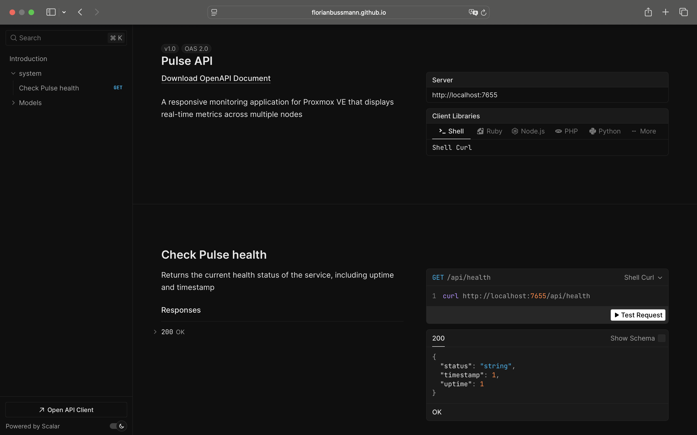
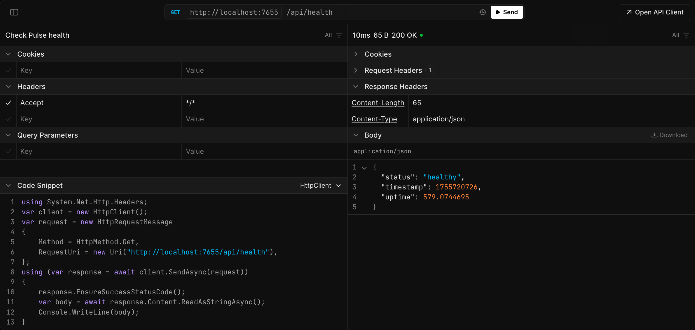

# Pulse API Reference

This branch hosts the [Scalar](https://scalar.com/) API Reference for the Pulse project, automatically generated from the OpenAPI ([Swagger](https://swagger.io/)) specification. It provides an interactive interface for exploring and testing the Pulse API.

*Not affiliated with the official Pulse project.*



## Access

You can view the API reference via GitHub Pages at: https://florianbussmann.github.io/Pulse

## Features

- Interactive documentation of Pulse API endpoints.
- Displays request parameters, response models, and example responses.
- “Try it out” functionality to test API calls directly in the browser.



## Notes

- The “Try it out” feature requires your Pulse instance to allow [CORS](https://developer.mozilla.org/en-US/docs/Web/HTTP/Guides/CORS) from the GitHub Pages origin. For this adjust your `.env`:
    ```env
    # CORS Settings (for reverse proxy setups)
    ALLOWED_ORIGINS=https://florianbussmann.github.io
    ```

- Scalar reads the [swagger.json](https://github.com/florianbussmann/Pulse/blob/docs/swagger/docs/swagger.json) file located in this fork’s branch [docs/swagger](https://github.com/florianbussmann/Pulse/tree/docs/swagger). It is not maintained by the original project and thus may not always be up-to-date.
